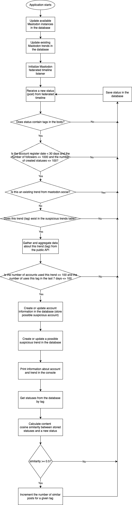

# Mastodon Fediverse Suspicious Trends and Accounts Analyser
### [Artur Khaialiev](a12020032@unet.univie.ac.at) (a12020032), P2 Course at the University of Vienna. Mentor: Paul Fuxjäger

## Goal
This project aims to help Mastodon-instance owners identify suspicious trends and accounts within a federated timeline. Instance owners can access the public service and filter the aggregated data to discover insights about their or others' servers.

## Features
- Read a stream of a federated timeline in real-time using [mastodon.social](https://mastodon.social/) public API
- Analyze data about suspicious tags and accounts within a federated timeline and aggregate data in the database
- Provide public endpoints to gather aggregated data with filtration and pagination
- Post content similarity check using nltk features and cosine similarity
- Production-ready asynchronous backend service with the ability to handle requests from multiple clients in parallel simultaneously

## How Does It Work? 


## Database Schema


## Tech Stack

This project uses the following frameworks and libraries:
- [Python](https://www.python.org/) - main programming language
- [Sanic Framework](https://sanic.dev/en/) - asynchronous Python web-framework
- [PostgreSQL](https://www.postgresql.org/) - main database
- [Alembic](https://alembic.sqlalchemy.org/en/latest/) - migrations tool
- [SQLAlchemy](https://www.sqlalchemy.org/) - SQL ORM
- [Mastodon.py](https://mastodonpy.readthedocs.io/en/stable/) - Python library to access Mastodon instances
- [httpx](https://www.python-httpx.org/) - Python HTTP-client
- [nltk](https://www.nltk.org/) - Natural Language Toolkit

## Installation

This project requires [Python](https://www.python.org/) v3.9+ and [Poetry](https://python-poetry.org/) to run 

1. Create a new virtual environment in the project folder
```sh
python3.9 -m venv venv
```

2. Activate environment
```sh
source venv/bin/activate
```

3. Install dependencies
```sh
poetry install
```

4. Set environment variables in the `.env` file (using `.env.example` template) in the project root folder. Make sure PostgreSQL runs in Docker (or anywhere else) and database and schema are created. You will also need an [instances.social](https://instances.social/api/token) API token and [mastodon.social](https://mastodon.social/settings/applications) access token with `read:statuses see all posts` . Example of `.env` file:
```sh
DB_HOST=localhost
DB_PORT=5432
DB_DATABASE=mastodon_db
DB_USERNAME=postgres
DB_PASSWORD=password
APP_HOST=0.0.0.0
APP_PORT=8000
APP_FORKS=1
SERVICE_SCHEMA=mastodon_service
INSTANCES_SOCIAL_ENDPOINT=https://instances.social/api/1.0
INSTANCES_SOCIAL_SECRET=...
MASTODON_INSTANCE_ENDPOINT=https://mastodon.social
MASTODON_INSTANCE_ACCESS_TOKEN=...
```

5. Apply all `alembic` migrations on PostgreSQL database
```sh
alembic upgrade head
```

6. Run the project
```sh
python server.py 
```

## Public Endpoints
This project has the following public REST-endpoints:
>Base localhost URL: `http://localhost:8000/api/v1/`
1. `GET` `/accounts` - get the list of suspicious accounts.
Optional parameters: 
- `limit` - 100 by default
- `offset` - 0 by default
- `instance` - instance URL filter
___
**Request example**:

`http://localhost:8000/api/v1/accounts?limit=10&offset=0&instance=anonsys.net`

**Response example**:
```
{
    "result": [
        {
            "id": 110196745358158160,
            "username": "augsburgerallgemeine",
            "acct": "augsburgerallgemeine@anonsys.net",
            "display_name": "Augsburger Allgemeine | inoffiziell",
            "locked": false,
            "bot": true,
            "discoverable": true,
            "group": false,
            "created_at": "2023-04-14T00:00:00",
            "note": "Spiegelt RSS Feeds von dieser URL weiter:<br><a href=\"http://www.augsburger-allgemeine.de/augsburg\" rel=\"nofollow noopener noreferrer\" target=\"_blank\">http://www.augsburger-allgemeine.de/augsburg</a>",
            "url": "https://anonsys.net/profile/augsburgerallgemeine",
            "avatar": "https://files.mastodon.social/cache/accounts/avatars/110/196/745/358/158/161/original/34b456f9a5deea4e.jpeg",
            "avatar_static": "https://files.mastodon.social/cache/accounts/avatars/110/196/745/358/158/161/original/34b456f9a5deea4e.jpeg",
            "header": "https://mastodon.social/headers/original/missing.png",
            "header_static": "https://mastodon.social/headers/original/missing.png",
            "followers_count": 2,
            "following_count": 0,
            "statuses_count": 44,
            "last_status_at": "2023-04-17T00:00:00",
            "instance_url": "https://anonsys.net"
        }
    ],
    "success": true,
    "limit": 10,
    "offset": 0,
    "total_count": 1
}
```
2. `GET` `/instances` - get the list of all captured instances where suspicious trends or accounts exist.
Optional parameters: 
- `limit` - 20 by default
- `offset` - 0 by default 
___
**Request example**:

`http://localhost:8000/api/v1/instances?limit=10&offset=0`

**Response example**:
```
{
    "result": [
        "https://glammr.us",
        "https://greenpeace.social",
        "https://leonardwong.dev",
        "https://wien.rocks",
        "https://anonsys.net",
        "https://troet.cafe",
        "https://mastodon.social",
        "https://toot.blue",
        "https://mastodon.hypnoguys.com",
        "https://ojousama-tea.party"
    ],
    "success": true,
    "limit": 10,
    "offset": 0,
    "total_count": 13
}
```
3. `GET` `/trends` - get the list of existing trends in the fediverse. The same list as [here](https://mastodon.social/explore/tags).
Optional parameters: 
- `limit` - 20 by default
- `offset` - 0 by default
- `instance` - instance URL filter
___
**Request example**:

`http://localhost:8000/api/v1/trends?limit=2&offset=0`

**Response example**:
```
{
    "result": [
        {
            "id": 281,
            "name": "Fotomontag",
            "url": "https://mastodon.social/tags/Fotomontag",
            "uses_in_last_seven_days": 260
        },
        {
            "id": 282,
            "name": "songsormoviesaboutsluggishmonday",
            "url": "https://mastodon.social/tags/songsormoviesaboutsluggishmonday",
            "uses_in_last_seven_days": 163
        }
    ],
    "success": true,
    "limit": 2,
    "offset": 0,
    "total_count": 20
}
```

4. `GET` `/suspicious_trends` - get the list of captured suspicious trends.
Optional parameters: 
- `limit` - 20 by default
- `offset` - 0 by default
- `instance` - instance URL filter
___
**Request example**:

`http://localhost:8000/api/v1/suspicious_trends?limit=10&offset=0&instance=anonsys.net`

**Response example**:
```
{
    "result": [
        {
            "id": 9,
            "name": "auto",
            "url": "https://mastodon.social/tags/auto",
            "uses_in_last_seven_days": 94,
            "number_of_accounts": 79,
            "instance_url": "https://anonsys.net",
            "number_of_similar_statuses": 0
        },
        {
            "id": 10,
            "name": "augsburg",
            "url": "https://mastodon.social/tags/augsburg",
            "uses_in_last_seven_days": 62,
            "number_of_accounts": 22,
            "instance_url": "https://anonsys.net",
            "number_of_similar_statuses": 0
        },
        {
            "id": 11,
            "name": "oktoberfest",
            "url": "https://mastodon.social/tags/oktoberfest",
            "uses_in_last_seven_days": 3,
            "number_of_accounts": 3,
            "instance_url": "https://anonsys.net",
            "number_of_similar_statuses": 0
        },
        {
            "id": 12,
            "name": "wolfganghubschle",
            "url": "https://mastodon.social/tags/wolfganghubschle",
            "uses_in_last_seven_days": 1,
            "number_of_accounts": 1,
            "instance_url": "https://anonsys.net",
            "number_of_similar_statuses": 3
        },
        {
            "id": 13,
            "name": "augsburgerplarrer",
            "url": "https://mastodon.social/tags/augsburgerplarrer",
            "uses_in_last_seven_days": 6,
            "number_of_accounts": 3,
            "instance_url": "https://anonsys.net",
            "number_of_similar_statuses": 0
        },
        {
            "id": 14,
            "name": "schattenseite",
            "url": "https://mastodon.social/tags/schattenseite",
            "uses_in_last_seven_days": 1,
            "number_of_accounts": 1,
            "instance_url": "https://anonsys.net",
            "number_of_similar_statuses": 1
        }
    ],
    "success": true,
    "limit": 10,
    "offset": 0,
    "total_count": 6
}
```
